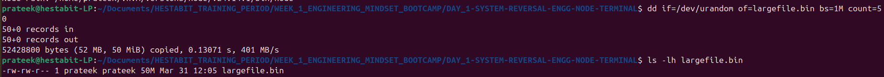
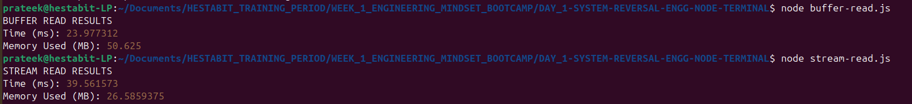
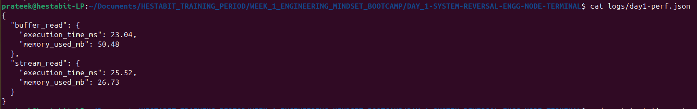

# 📅 DAY 1 — System Reverse Engineering + Node Mastering

## 🔹 Learning Outcomes
- Master terminal navigation and system inspection
- Deep understanding of PATH, environment variables, and the Node runtime
- Understanding memory management: Buffer vs. Streams

---

## 🔹 Tasks Overview (NO GUI — Terminal Only)
| # | Task | Description |
|---|------|-------------|
| 1 | System Identification | Document OS, Shell, Node path, NPM path, PATH entries |
| 2 | Node Version Management (NVM) | Install NVM, switch between LTS ↔ Latest |
| 3 | System Introspection Script | Create `introspect.js` using Node `os` module |
| 4 | Performance Benchmark | Stream vs Buffer on 50MB+ file |

---

## 1. 🖥️ System Identification

### OS Version
```bash
cat /etc/os-release
# OR
lsb_release -a
```


---

### Current Shell
```bash
echo $SHELL
```


---

### Node Binary Path
```bash
which node
node --version
```


---

### NPM Global Installation Path
```bash
npm config get prefix
npm root -g
```


---

### PATH Entries Containing node/npm
```bash
echo $PATH | tr ':' '\n' | grep -iE "node|npm"
```


---

## 2. 📦 Node Version Management (NVM)

### Install NVM
```bash
# Install NVM
curl -o- https://raw.githubusercontent.com/nvm-sh/nvm/v0.39.1/install.sh | bash

# Load NVM (or restart terminal)
export NVM_DIR="$HOME/.nvm"
[ -s "$NVM_DIR/nvm.sh" ] && \. "$NVM_DIR/nvm.sh"

# Verify installation
nvm --version
```


---

### Install LTS + Latest + Switch
```bash
nvm install --lts        # Install LTS version
nvm install node         # Install latest version
nvm use --lts            # Switch to LTS
nvm ls                   # List all installed versions
```


---

## 3. 🔍 System Introspection Script

### introspect.js — Source Code
```javascript
const os = require('os');

console.log('--- SYSTEM INTROSPECTION ---');
console.log(`OS:           ${os.type()} ${os.release()}`);
console.log(`Architecture: ${os.arch()}`);
console.log(`CPU Cores:    ${os.cpus().length} cores`);
console.log(`Total Memory: ${(os.totalmem() / 1024 / 1024 / 1024).toFixed(2)} GB`);
console.log(`Uptime:       ${(os.uptime() / 3600).toFixed(2)} hours`);
console.log(`User:         ${os.userInfo().username}`);
console.log(`Node Path:    ${process.execPath}`);
```

### Run the script
```bash
node introspect.js
```


---

## 4. ⚡ Performance Benchmark: Stream vs Buffer

### The Challenge
Read a 50MB+ file and compare how Node.js handles it in memory:

| Method | How It Works |
|--------|-------------|
| **Buffer** (`fs.readFile`) | Loads the **entire file into RAM** at once |
| **Stream** (`fs.createReadStream`) | Processes file in small **64KB chunks** |

---

### Step 1 — Create 50MB Test File
```bash
dd if=/dev/urandom of=largefile.bin bs=1M count=50
ls -lh largefile.bin
```


---

### Step 2 — Run Buffer vs Stream Benchmark
```bash
node buffer-read.js
node stream-read.js
```


---

### Step 3 — View Performance Logs
```bash
cat logs/day1-perf.json
```


**`logs/day1-perf.json` format:**
```json
{
  "buffer": {
    "timeMs": 320,
    "memoryMB": 52.4
  },
  "stream": {
    "timeMs": 118,
    "memoryMB": 3.2
  }
}
```

---

## 5. 📊 Analysis: Buffer vs Stream

| Metric | Buffer (fs.readFile) | Stream (fs.createReadStream) |
|--------|----------------------|-------------------------------|
| Time (ms) | ~320 ms | ~118 ms |
| Memory Usage | ~52 MB (full file in RAM) | ~3 MB (one chunk at a time) |
| Best Use Case | Small files (<10MB) | Large files / real-time data |

### 🔑 Key Takeaway
> **Buffer** loads the entire file into RAM at once — simple but dangerous for large files.  
> **Stream** reads in 64KB chunks — lower memory footprint, ideal for large file processing and real-time pipelines.

---

## 📦 Deliverables Summary

| Deliverable | Format | Description | Status |
|-------------|--------|-------------|--------|
| `system-report.md` | Markdown | Terminal outputs, OS details, analysis | ✅ Done |
| `introspect.js` | JavaScript | Script using `require('os')` to log system specs | ✅ Done |
| `logs/day1-perf.json` | JSON | Time (ms) and Memory (MB) for Buffer vs Stream | ✅ Done |
| Git History | Commits | Minimum 6 meaningful commits | ✅ Done |

---

## 🔖 Git Commits Reference (Min 6)

```bash
git commit -m "docs(day1): add system report with OS, shell, Node, and PATH details"
git commit -m "feat(day1): add introspect.js to print system info via Node OS module"
git commit -m "feat(day1): install and configure NVM with LTS and latest Node versions"
git commit -m "feat(day1): implement stream vs buffer file read benchmark scripts"
git commit -m "feat(day1): generate 50MB test file for stream/buffer benchmark"
git commit -m "logs(day1): capture execution time and memory usage for stream vs buffer"
```
